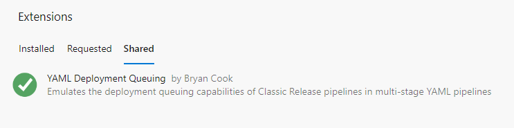

# Installation

As this extension contains a pipeline-decorator, it cannot be converted to a publicly available extension in the marketplace.
This document outlines how you can install this extension in your Azure DevOps Organization.

You have three possible options:

1. Install via _Sharing_
1. Fork and Publish
1. Install Manually (Azure DevOps Server Only)

## Install via Sharing

A private extension can be "shared" so that it is made available to your Azure DevOps Organization. Once shared, your Project Collection Administrator can install it through the link available in **General > Extensions : Shared** tab.

To add your organization to the extension's shared list, [open an issue][new-issue] and provide your details.

[new-issue]: https://github.com/bryanbcook/deploymentqueuing-extension/issues/new

## Fork and Publish

You may choose to publish this extension to your own organization.

Azure DevOps setup:

1. Fork this repository

   - Please Star or Fork the repository so that I know this extension is being used :-)

1. Create a new Project in your Azure DevOps Organization and link the GitHub repository.
   - Alternatively, you can import the git repository into an Azure DevOps repository.

1. Install the [Azure DevOps Extensions Tasks][extensions-task] and follow their "How to use" instructions on how to setup a PAT token that can communicate with the marketplace.

1. In your Azure DevOps Project, create a "Visual Studio Marketplace" Service-Connection that uses the PAT token

1. Create a variable group `pipeline-extension-settings` and add the following:

   | Name           | Value |
   |----------------|-------|
   | ExtensionsId   | name of the extension, eg `deploymentqueuingdecorator`
   | Extension Name | display name for the decorator.
   | PublisherId    | your publisher name in the marketplace
   | SharedWith     | comma-delimited list of azure devops organizations

1. Create a new Pipeline and link it to the existing YAML pipeline [/devops/pipelines/marketplace-extension/pipeline.yml][pipeline]

Marketplace Setup:

1. Login to the [Marketplace `(https://marketplace.visualstudio.com`)](https://marketplace.visualstudio.com) using the same identity that you used to create the PAT token.
1. Click on the [Publish extensions](https://marketplace.visualstudio.com/manage) link
1. Click on the **Create Publisher** button and fill in the basic details.
1. Before you can run the pipeline, the extension must exist in the marketplace:

   1. Clone the repository locally
   1. Install tfx extensions: `npm install -g tfx-cli`
   1. Modify the [/src/vssextension.json][vss-extension] to match the values in the variable group above:
      - extension name
      - publisher name
   1. Create the extension: `tfx extension create -r src`

1. Upload the extension (*.vsix) to your publisher.

1. Share the extension with your organization. (Optional, because the pipeline will also share with the organizations you specified in the `SharedWith` variable)

Now you can run the pipeline to promote changes or share with additional organizations of your choosing.

## Install Manually (Azure DevOps Server)

1. Download the latest published release (TODO)
1. Navigate to `<https://<your-server>/_gallery/manage>` and upload the extension.

[extensions-task]: https://marketplace.visualstudio.com/items?itemName=ms-devlabs.vsts-developer-tools-build-tasks&targetId=689d18b7-020a-4b8e-9aa4-8f2a9f4f9359&utm_source=vstsproduct&utm_medium=ExtHubManageList

[pipeline]: https://github.com/bryanbcook/deploymentqueuing-extension/blob/main/devops/pipelines/marketplace-extension/pipeline.yml

[vss-extension]: https://github.com/bryanbcook/deploymentqueuing-extension/blob/main/src/vss-extension.json
