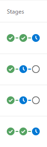
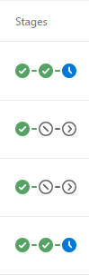

# Azure DevOps Deployment Queuing for YAML Pipelines

Deployment Queue Settings is a feature of Classic Release pipelines that "define the behavior when multiple releases are queued for deployment." This [includes a setting that specifies][1] what should happen if a newer build is queued while an existing build is queued or waiting for approval. This extension aims to emulate the _"Deploy latest and cancel the others"_ capability for YAML multi-stage pipelines.

By default, YAML pipelines will remain in a pending state until they timeout -- which by default is 30 days. This extension adds functionality that will auto-cancel older pipelines when a newer build completes successfully.

Notes:

- Only older builds that are in a pending state for the current stage are impacted.
- Only applies to multi-stage YAML pipelines with that use a [`deployment`][3] job. The stage must have an existing [gate][2] that pauses before execution.
- Each pipeline must opt-in to enable this behavior using the `deploymentQueuing.enable` variable, either as a global pipeline variable as a stage/job variable. See usage below.
- The pipeline agent user account must be granted to the _"Stop Build"_ permission.

Without deployment queuing:



With deployment queuing, previously queued pipelines are automatically cancelled after a more recent build completes:



[1]: https://docs.microsoft.com/en-us/azure/devops/pipelines/process/stages?view=azure-devops&tabs=classic#queuing-policies
[2]: https://learn.microsoft.com/en-us/azure/devops/pipelines/process/approvals?view=azure-devops&tabs=check-pass
[3]: https://learn.microsoft.com/en-us/azure/devops/pipelines/process/deployment-jobs?view=azure-devops

## Usage

To enable deployment-queueing to your multi-stage YAML pipeline:

1. Install this extension into your Azure DevOps Organization.
1. Grant the identity of your pipeline agent the _"Stop Build"_ permission per Project.
1. Add the _deploymentQueuing.enable_ variable to your pipeline. This can be defined at the pipeline-level or per stage.

   ```yaml
   variables:
     deploymentQueuing.enable: true
   ```

When the pipeline runs, it will automatically inject a step into your pipeline to cancel any pending pipelines.


> **Note:**
>
> Your stage must use a [`deployment`][3] job that


## Example

Consider a multi-stage pipeline with three stages. Each stage uses a `deployment` task and an `Azure Pipeline Environment`.  The _QA_ and _Prod_ environments are defined with an approval gate that will pause pipelines runs until an approval is provided.

Because the _Project_ has the policy _"limit job authorization scope to current project for non-release pipelines"_ disabled, the pipeline will run under the Project Collection Build Service user account.  This account has been granted the "Stop Build" permission in our _Project_.

```yaml
trigger:
  branches:
    include:
    - main

variables:
  deploymentQueuing.enable: true

stages:
- stage: build
  jobs:
  - job: build
    steps:
    - script: echo 'hello world'

- stage: QA
  jobs:
  - deployment: qa_deploy
    environment: QA
    strategy:
      runOnce:
        deploy:
          steps:
          - script: echo 'deploy into qa'

- stage: PROD
  jobs:
  - deployment: prod_deploy
    environment: PROD
    strategy:
      runOnce:
        deploy:
          steps:
          - script: echo 'deploy into prod'
```

## FAQ

### How do I assign my pipeline agent the "Stop Build" permission?

First determine the authorization scope for your pipelines:

1. In your project, navigate to Settings
1. Select **Pipelines > Settings**
1. Review the setting for _"Limit job authorization scope to current project for non-release pipelines"_

If this value is enabled, your pipelines operate using a user account _`<Project Name> Build Service (<Organization Name)`_

If this value is not enabled, your pipelines operate under _`Project Collection Build Service (<Organization Name)`_.

Next, configure the permissions for the build agent:

1. In the side-menu, select **Pipelines > Pipelines**
1. From the elipsis in the top-right, select **Manage Security**
1. In the _search for users or groups_ textbox, type in the name of the user account identified above.
1. Set the _"Stop Builds"_ permission to **Allow**

### Why is the post-job step not being added?

The `deployment-queuing` feature requires the following:

- your stage uses a [`deployment`][3] job associated with a Pipeline Environment.
- the `deploymentQueueing.enable` variable must be set to `true`

### What happens if I'm not using approval-checks or there are no queued pipelines?

Nothing. This extension adds a post-job task to cancel any pending builds that are pending for the stage that just completed. If there are no approval gates or previously pending builds, the script happily ignores them.

## I'm running a self-hosted runner, does this have special requirements?

Your self-hosted runner needs to have PowerShell or PowerShell Core installed.
